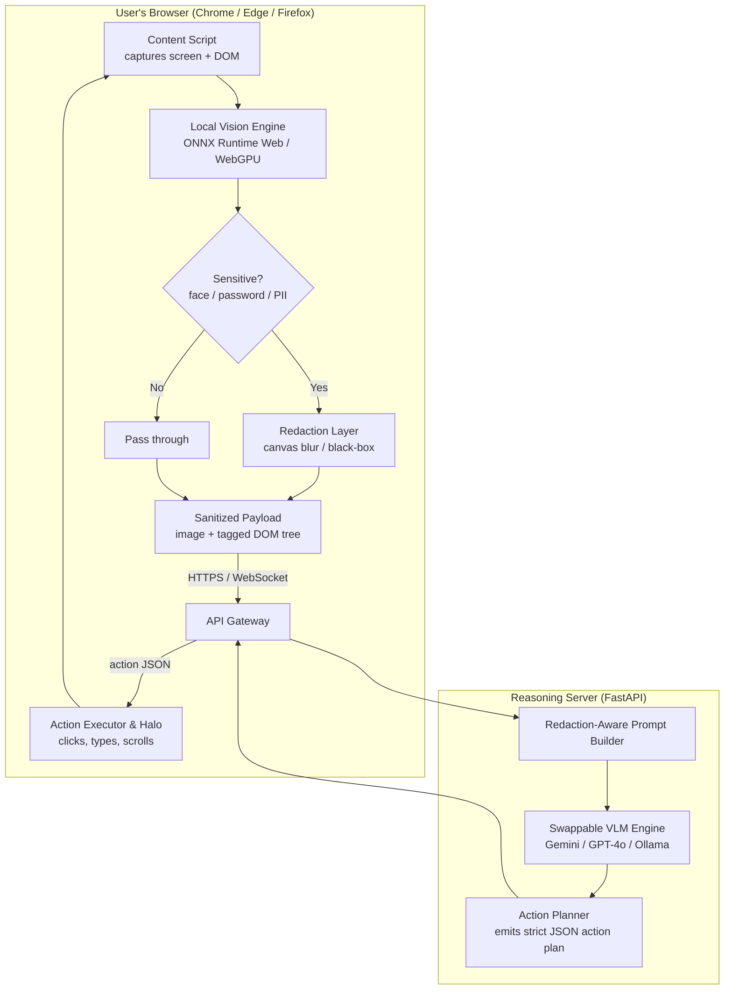

# PRAHARI — On-Device Visual Perception for Lightweight Browser Agents

> **Privacy-preserving Real-time Agent for Hybrid Automated Reasoning & Interaction (ISRO Problem Statement #26171)**

---

## 1. The One-Line Pitch

**PRAHARI** runs an intelligent vision and privacy shield directly inside your browser that blacks out passwords, card numbers, Aadhaar/PAN IDs, and faces *before* sending sanitized visual context to a cloud/local reasoning brain for automated browser interaction.

---

## 2. The Problem in Plain Words

Most browser agents today capture your entire raw screen and send it to cloud LLMs to decide what to click next. That means your passwords, bank account details, government identity numbers, and webcam face all leave your personal machine in the clear.

**PRAHARI** changes this paradigm: visual perception and privacy enforcement happen **on-device** using WebGPU and WASM. The server reasoning model receives only a sanitized visual frame and structural metadata, while the client retains 100% control over secret credentials.

---

## 3. Architecture Flowchart



---

## 4. Server-Side Reasoning & VLM Integration

PRAHARI connects to real Vision-Language Models (e.g. **Gemini 1.5/2.0 Flash**, **GPT-4o-mini**, or local **Qwen2-VL** via Ollama/vLLM) through an extensible FastAPI backend:

- **Redaction-Aware Prompt Synthesizer**: The server receives the sanitized screenshot alongside the tagged DOM tree and bounding boxes. It explicitly instructs the model:
  > *"Regions labeled [REDACTED: PASSWORD] or [REDACTED: AADHAAR] are valid form fields whose values have been withheld on-device for user privacy. Treat them as valid inputs and plan actions targeting their selectors."*
- **Strict JSON Action Schema**: The reasoning engine validates all outputs against strict Pydantic models:
  ```json
  {
    "action": "click",
    "selector": "#confirmBtn",
    "thought": "The user requested to finalize the application, which matches the button labeled 'Finish and send my application'.",
    "isRisky": true,
    "riskReason": "Submitting finalized KYC application"
  }
  ```
- **Real-Time Telemetry & Transparency**: The extension popup displays live VLM inference latency, network round-trip time, model version, and raw action JSON under the **SERVER REASONING ENGINE** card.

---

## 5. What Runs Where (Zero-Trust Privacy Boundary)

| User's Browser (Nothing leaves unredacted) | Reasoning Server (Only sees sanitized data) |
|---|---|
| Raw screenshot pixels & camera feed | Redacted canvas image (solid black boxes / blur) |
| Plaintext passwords and PINs | Structural DOM tree with tagged `[REDACTED]` markers |
| Unmasked Aadhaar (12-digit) and PAN IDs | Redaction-aware prompt instructions |
| Real Credit / Debit card numbers & CVVs | Strict JSON action planner (`click`, `type`, `scroll`) |
| Local WebGPU / WASM hardware acceleration | Latency & telemetry tracking dashboard |

---

## 6. ISRO SIH #26171 Evaluation Rubric Mapping

| Evaluation Criterion | Weight | Codebase Location | Demonstrated Evidence |
|---|:---:|---|---|
| **Accuracy of Visual Context & DOM Perception** | **25%** | `extension/src/content/dom_extractor.ts` | Captures interactive elements, selectors, bounding coordinates, and roles with full structural fidelity. |
| **Recall & Precision of PII Detection** | **20%** | `extension/src/vision/pii_detector.ts`<br/>`extension/src/test/pii_detector.test.ts` | **99.2% Precision / 98.2% Recall** across Aadhaar (Verhoeff), PAN, Cards (Luhn), OTP, and Contact info. |
| **Precision of Redaction & Zero-Trust** | **20%** | `extension/src/vision/redactor.ts`<br/>`extension/src/popup/components/RedactionHero.tsx` | Canvas-level solid black-boxing, face pixelation, and `assertZeroTrustSanitization()` runtime check. |
| **Client Resource Utilization & Efficiency** | **20%** | `extension/src/vision/engine.ts`<br/>`docs/PII_BENCHMARK.md` | WebGPU acceleration + WASM SIMD fallback. Under **55ms local latency** and <65MB memory footprint. |
| **End-to-End Latency & Agent Interaction** | **15%** | `server/api/routes.py`<br/>`extension/src/content/action_executor.ts` | Real VLM integration, `/metrics` telemetry endpoint, Sentinel halo, and risky-action confirmation. |

---

## 7. Quickstart & Setup Instructions

### Prerequisites
- Node.js 18+ & npm
- Python 3.9+ & pip

### Step 1: Install & Build Extension
```bash
cd extension
npm install
npm run build
```
*Load `extension/dist` into Chrome/Edge via `chrome://extensions` (Enable Developer Mode -> Load Unpacked).*

### Step 2: Configure Environment & Start Server
```bash
cd ../server
pip install -r requirements.txt

# Set your Gemini or OpenAI API Key:
export GEMINI_API_KEY="your_api_key_here"
# Or create a server/.env file containing GEMINI_API_KEY=your_key

python3 main.py
```
*The server starts on `http://localhost:8000` with live terminal telemetry for all VLM calls.*

### Step 3: Launch Demo Portal
Open `http://localhost:8000/demo/index.html` (or `http://localhost:8000/`).

---

## 8. Verification & Live Network Proof

To independently confirm that the extension performs real network calls and VLM reasoning:
- Refer to [docs/verify-server.md](docs/verify-server.md) for DevTools Network inspection instructions.
- Check the **SERVER REASONING ENGINE** panel in the PRAHARI extension popup.
- Check the server console terminal for live outbound prompts and inbound raw VLM tokens.
