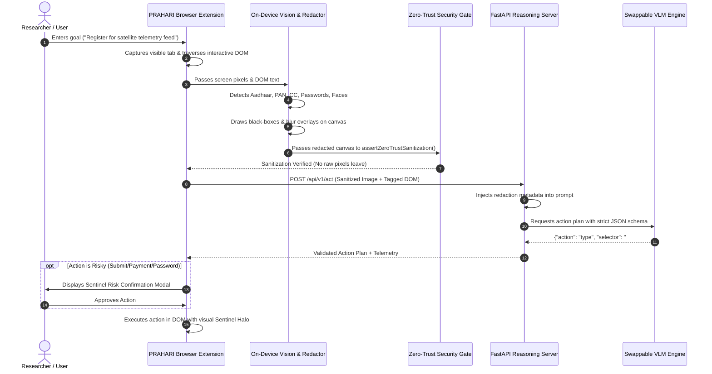

# PRAHARI System Architecture & Design Specification

**PRAHARI** (*Privacy-preserving Real-time Agent for Hybrid Automated Reasoning & Interaction*) is an on-device visual perception and action planning framework for lightweight browser agents, engineered for **ISRO SIH Problem Statement #26171**.

---

## 1. High-Level Architecture Diagram

```mermaid
flowchart TB
    subgraph Client["User's Browser (Chrome / Edge / Firefox)"]
        direction TB
        A[Tab Capture + DOM Extractor<br/>Viewport Screen + Interactive Nodes] --> B[Hardware Capability Engine<br/>WebGPU with Auto Fallback to WASM SIMD]
        B --> C[Local Multi-Stage Detector<br/>• Verhoeff Checksum Aadhaar<br/>• PAN Card Regex [A-Z]{5}[0-9]{4}[A-Z]<br/>• Luhn Credit Cards<br/>• Password / OTP / Email / Phone<br/>• Facial Bounding Box Detector]
        C --> D{Zero-Trust Gate<br/>Are all sensitive regions identified?}
        D -->|Yes| E[Canvas Redaction Engine<br/>• Solid Obsidian Black-Boxes<br/>• Amber Category Badges<br/>• Face Pixelation Mosaic]
        E --> F[Zero-Trust Cryptographic Assertion<br/>assertZeroTrustSanitization()]
        F -->|Verified Clean| G[Sanitized Visual & Structural Payload<br/>Base64 Redacted Image + Tagged DOM JSON]
        F -->|Leak Detected| H[ABORT TRANSMISSION]
        
        Q[Action Executor & Sentinel Halo] -->|Execute Action| A
        R[Risky-Action User Confirmation Modal] -.->|Gate Risky Ops| Q
    end

    subgraph Server["PRAHARI Reasoning Infrastructure"]
        direction TB
        G -->|HTTPS POST / WebSocket| I[API Gateway & Telemetry Logger]
        I --> J[Redaction-Aware Prompt Synthesizer<br/>Contextualizes masked regions as valid private inputs]
        J --> K[Swappable VLM Reasoning Engine<br/>• Cloud API: Gemini 1.5 Flash / GPT-4o<br/>• Local Host: Qwen2-VL / LLaVA (Ollama/vLLM)<br/>• Offline Rule Engine: 100% booth uptime]
        K --> L[Strict JSON Action Plan Validator]
        L -->|Validated Action Plan| I
    end

    I -->|AgentAction JSON| R
```

---

## 2. Sequence Diagram (End-to-End Task Execution)



---

## 3. Core Architectural Differentiators

### A. Zero-Trust Visual Assertion
Unlike traditional tools where privacy is an afterthought, PRAHARI executes a client-side verification check (`assertZeroTrustSanitization`) directly on the memory canvas before serialization. If any sensitive coordinate contains unmasked pixels, the transmission is immediately killed.

### B. Redaction-Aware Prompting
Standard vision models become confused when encountering black boxes on screen. PRAHARI constructs a structured prompt informing the VLM that masked areas are valid inputs whose values are withheld for privacy, enabling seamless reasoning over forms without leaking secrets.

### C. Multi-Tier Acceleration
- **Tier 1 (High Performance)**: WebGPU hardware acceleration on modern Chromium browsers.
- **Tier 2 (Universal Compatibility)**: WASM SIMD 128-bit vector execution on Firefox and low-power hardware.
- **Tier 3 (Degraded)**: WASM CPU fallback ensuring zero crashes across any client.
